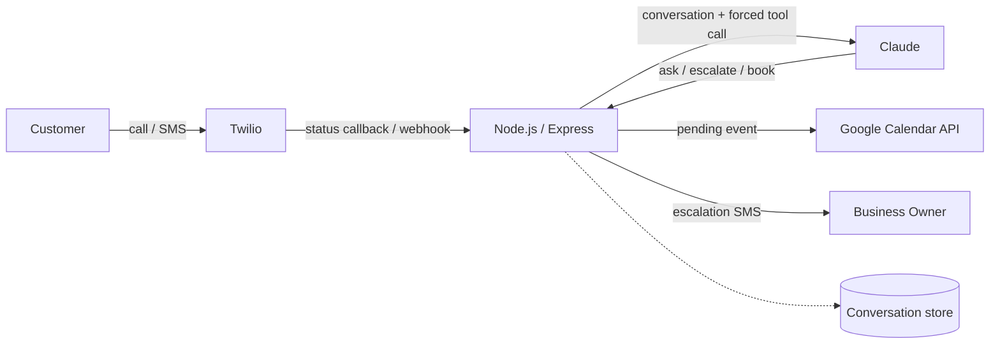

# Leverage AI — Architecture

AI-driven missed-call recovery for home-service businesses (HVAC, plumbing, electrical). When a call to the business goes unanswered, the system texts the caller back within seconds, qualifies the lead through a constrained AI conversation, and creates a pending booking on the business's calendar for a human to confirm.

> This repo documents the architecture only. The production source (business logic, prompts, client configs) is closed — this is a live product I run for real clients.

**[Full technical case study →](https://claude.ai/code/artifact/4673b74b-e61d-4914-8d1d-b514a10c6091)**

## The problem

A missed call at a home-service business is a lost job — typically worth $1,000–$5,000. The caller doesn't leave a voicemail; they call the next name on the list. Existing answering services are slow, expensive, or just take a message instead of actually qualifying and booking the lead.

## Design constraint

The hard part isn't "call an LLM" — it's making an AI safe to text real customers unsupervised. The model is never allowed to freelance:

- It can only return one of three structured outcomes — **ask**, **escalate**, or **book** — via a forced tool call, never free text back to the customer
- It never quotes a price
- It never promises a specific arrival time — it collects the customer's preferred window and creates a *pending* calendar event, clearly marked for a human to confirm
- Anything ambiguous, urgent, or price-related escalates immediately to a text alert to the business owner

## Architecture

**Flow:**
1. A call to the business's Twilio number goes unanswered
2. Twilio's status callback hits `/webhook/missed-call` → an instant text-back is sent
3. Every reply the caller sends hits `/webhook/sms` → Claude decides the next step via a forced tool call (never free text)
4. Once qualified (service type, urgency, location, requested time), a pending event is created on Google Calendar
5. Emergencies, pricing questions, or anything ambiguous escalate immediately via SMS to the business owner

## Stack

| Layer | Technology |
|---|---|
| Runtime | Node.js, Express |
| Telephony | Twilio Voice + SMS API |
| AI decisioning | Anthropic Claude — forced tool-use |
| Scheduling | Google Calendar API (OAuth2) |
| State | In-memory conversation store (per-caller) |
| Config | Per-tenant, `.env`-driven |

## Verified

The pipeline has been tested end-to-end against the live services (not mocks): Twilio SMS delivery confirmed via the Messages API, Claude qualification run through a full multi-turn conversation, and a real pending event created and confirmed on Google Calendar via the Calendar API.

---

Built by [Eddie Chongtham](https://github.com/eddie7ch) — [mlebotics.com](https://mlebotics.com)
